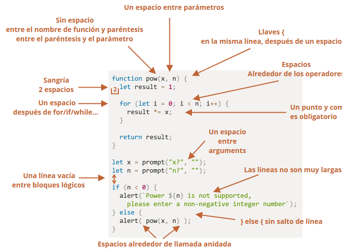

# Aprendiendo Javascript - Parte 2

## Calidad de Codigo

### Debugging en el navegador

- Todos lo exploradores modernos y la mayoría de los otros ambientes soportan el “debugging” – una herramienta especial de UI para desarrolladores que nos permite encontrar y reparar errores más fácilmente.
  - El panel “sources/recursos”
  - Console
  - Breakpoints (puntos de interrupción)
- Usando el comando “debugger” -> `debugger;``
- Para escribir algo en la consola, existe la función console.log.

Archivos adjuntos:
- debug.js

### Estilo de codificación
- El codigo debe ser lo más limpio y fácil de leer como sea posible.

- la llave de apertura en la misma linea como la correspondiente palabra clave – no en una nueva linea. 
- Es una buena práctica dividir las lineas grandes.
- Intentar evitar anidar el código en demasiados niveles de profundidad.
