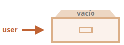

# Aprendiendo Javascript - Parte 3(Objetos lo basico)

## Objetos
- Los objetos son usados para almacenar colecciones de varios datos y entidades más complejas asociados con un nombre clave. 
- Los objetos son usados para almacenar colecciones de varios datos y entidades más complejas asociados con un nombre clave. 
- Imagen referencial al crear un objeto
  
- La declaracion de un objeto literal, se usa llave {...}.
- Dentro de las {...} se puede poner algunas propiedades.
- Asi quedaria un objeto creado, podemos agregar, eliminar y leer archivos de él en cualquier momento.
  
- Las claves con más de una palabra deben ir entre comillas. Ejem: "likes birds": true .
- Para acceder a claves de mas de una palabra se usa los corchetes.
- La última propiedad en la lista puede terminar con una coma, se llama una coma “final” o “colgante”. 
- Para hacer mas corta la creacion de propiedades, se utiliza el atajo de propiedades.
- Los nombres de las propiedades pueden ser igual a la de una palabra reservada, **no tiene restrinccion**.
- La lectura de una propiedad no existente solo devuelve "undefined".
- Para probar si una prpiedade existe se puede usar ".noSuchProperty".
- Para recorrer las claves de un objeto se puede usar el bucle "for...in".

## Referencias de objetos y copia
- Los objetos son almacenados y copiados "por referencia".
- Los primitivos: strings, number, boolean, etc.; son asignados y copiados “como un valor completo”.
- Una variable no almacena el objeto mismo sino su “dirección en memoria”, en otras palabras “una referencia” a él.
- Podemos usar cualquiera de las variables para acceder al objeto y modificar su contenido.
- Dos objetos son iguales solamente si ellos son el mismo objeto.
- Para clonar un objeto se puede usar el método Object.assign.
- En las clonaciones anidadas, las propiedades pueden ser referencias a otros objetos.
- La llamada a structuredClone(object) clona el object con todas sus propiedadas anidadas.
- El método structuredClone puede clonar la mayoría de los tipos de datos, como objetos, arrays, valores primitivos.

