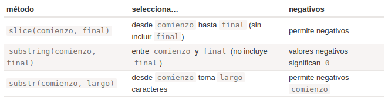

# Aprendiendo Javascript - Parte 4(Tipos de datos)

## Recursos

[Tipos de datos](https://es.javascript.info/data-types)

## Métodos en tipos primitivos
- Un primitivo:
  - Es un valor de tipo primitivo.
  - Hay 7 tipos primitivos: string, number, bigint, boolean, symbol, null y undefined.
  - El lenguaje permite el acceso a métodos y propiedades de strings, numbers, booleans y symbols.
- Un objeto:
  - Es capaz de almacenar múltiples valores como propiedades.
  - Puede ser creado con {}. Ejemplo: {name: "John", age: 30}. 
  - Hay otras clases de objetos en JavaScript; las funciones, por ejemplo, son objetos.
  - podemos almacenar una función como una de sus propiedades.
- Un “object wrapper” (objeto envoltorio) que provee la funcionalidad extra y luego es destruido.
  - Los “object wrappers” son diferentes para cada primitivo y son llamados: String, Number, Boolean, Symbol y BigInt. Así, proveen diferentes sets de métodos.
- Los primitivos especiales null y undefined son excepciones. No tienen “wrapper objects” correspondientes y no proveen métodos. En ese sentido son “lo más primitivo”.

## Number
- Hay 2 tipos de numeros:
  - **Números de doble precisión de coma flotante**: Los números regulares que son almacenados con formato de 64-bit IEEE-754.
  - **Números BigInt:** representan enteros de longitud arbitraria.
- Aquí _ es “azúcar sintáctica”, hace el número más legible. El motor JavaScript simplemente ignora _ entre dígitos, así que es exactamente igual al “billion” de más arriba.
- cortamos un número agregando la letra "e" y especificando la cantidad de ceros.
- En los números negativos detrás de "e" significa una división por el 1 seguido de la cantidad dada de ceros.
- Los números Hexadecimales son ampliamente usados en JavaScript para representar colores, codificar caracteres y muchas otras cosas.
- El método num.toString(base) devuelve la representación num en una cadena, en el sistema numérico con la base especificada.
- Redondeo: Hay varias funciones incorporadas para el redondeo:
  - **Math.floor:** Redondea hacia abajo: 3.1 se convierte en 3, y -1.1 se hace -2.
  - **Math.ceil:** Redondea hacia arriba: 3.1 torna en 4, y -1.1 torna en -1.
  - **Math.round:** Redondea hacia el entero más cercano: 3.1 redondea a 3, 3.6 redondea a 4, el caso medio 3.5 redondea a 4 también.
  - **Math.trunc (no soportado en Internet Explorer):** Remueve lo que haya tras el punto decimal sin redondear: 3.1 torna en 3, -1.1 torna en -1.
- Tests: isFinite e isNaN
  - Infinity (y -Infinity) es un valor numérico especial que es mayor (menor) que cualquier otra cosa.
  - NaN (“No un Número”) representa un error.
  - Hay funciones especiales para chequearlos:
    - **isNaN(value)** convierte su argumento a número entonces testea si es NaN.
    - **isFinite(value)** convierte su argumento a un número y devuelve true si es un número regular, no NaN/Infinity/-Infinity
- parseInt y parseFloat:
  - la conversión numérica usando un más + o Number() es estricta. Si un valor no es exactamente un número, falla. `alert( +"100px" ); // NaN`
  - Estas “leen” el número desde un string hasta que dejan de poder hacerlo.
  - La función parseInt devuelve un entero, mientras que parseFloat devolverá un punto flotante.
- Otras funciones matemáticas:
  -  Math que contiene una pequeña biblioteca de funciones matemáticas y constantes.
     -  Math.random
     -  Math.max -Math.min
     -  Math.pow
     -  Hay más funciones y constantes en el objeto Math, incluyendo trigonometría, que puedes encontrar en la documentación del objeto Math.

## String
- Los datos textuales son almacenados como strings (cadena de caracteres).
- El formato interno para strings es siempre UTF-16, no está vinculado a la codificación de la página.
- **Comillas:** Los strings pueden estar entre comillas simples, comillas dobles o backticks (acento grave).
  - los “backticks” nos permiten además ingresar expresiones dentro del string envolviéndolos en ${…}
  - usar backticks es que nos permiten extender en múltiples líneas el string
- **Caracteres especiales:** 
  - carácter de nueva línea(\n):   crear strings de múltiples líneas usando comillas simple.
- todos los caracteres especiales empiezan con la barra invertida \. Se lo llama “carácter de escape”
- La propiedad ‘length’ contiene el largo del string.
- Para acceder a un carácter en la posición pos, se debe usar corchetes, [pos], o llamar al método str.at(pos). 
- Los corchetes siempre devuelven undefined para índices negativos.
- Podemos además iterar sobre los caracteres usando for..of
- Los métodos **toLowerCase()** y **toUpperCase()** cambian los caracteres a minúscula y mayúscula.
- Buscando una subcadena de caracteres:
  -  str.indexOf(substr, pos): Este busca un substr en str, comenzando desde la posición entregada pos, y retorna la posición donde es encontrada la coincidencia o -1 en caso de no encontrar nada.
  -  str.lastIndexOf(substr, position): busca desde el final del string hasta el comienzo.
  -  **Nota:** Existe un leve inconveniente con indexOf en la prueba if
- El método más moderno str.includes(substr, pos) devuelve true o false si str contiene substr o no.
- Existen 3 métodos en JavaScript para obtener un substring: substring, substr y slice. str.slice(comienzo [, final]).

-  los strings son comparados carácter por carácter en orden alfabético.
   -  Una letra minúscula es siempre mayor que una mayúscula:
   - Las letras con marcas diacríticas están “fuera de orden”.
## Array
- Existe una estructura llamada Array (llamada en español arreglo o matriz/vector) para almacenar colecciones ordenadas.
- Los elementos del array están numerados comenzando desde cero.
- Se puede reemplazar o agregar un elemento.
- También podemos usar alert para mostrar el array completo.
- Un array puede almacenar elementos de cualquier tipo.
- Un array puede almacenar elementos de cualquier tipo.
- La “coma final” hace más simple insertar y remover items, porque todas la líneas se vuelven similares.
- Una cola es uno de los usos más comunes de un array.
  - push inserta un elemento al final.
  - shift obtiene el elemento del principio, avanzando la cola, y así el segundo elemento se vuelve primero.
- La estructura de datos llamada pila.Ella soporta dos operaciones:
  - push agrega un elemento al final.
  - pop toma un elemento desde el final.

